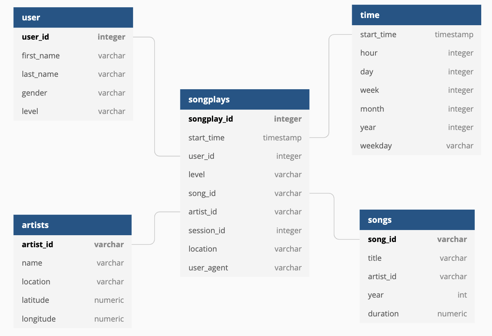

###### Data Engineering Nanodegree Project 1
## Data Modeling with Postgres

## Project description
In this project, we collect data on songs and user activity logs from the startup Sparkify's music streaming app.
The raw data are in JSON format. We need to desgin database schema, create a Postgres database, build ETL pipeline using Python scripts and import the JSON raw data into the database.

#### Database purpose
Store song and user activity information extracted from JSON files for further analytical queries

#### Analytical goal
Understand what songs users are listening to (e.g which song play most, different song preference for users in different age group, what kind of music is most or least popular etc)

This project practise following course contents:
- Data modeling for relational database
- Fact & dimension tables (star schema)
- ELT pipline with Python scripts (Python + psycopg2)

## Raw data
- Song: metadata about a song and the artist of the song

```
{"num_songs": 1, "artist_id": "ARJIE2Y1187B994AB7", "artist_latitude": null, "artist_longitude": null, "artist_location": "", "artist_name": "Line Renaud", "song_id": "SOUPIRU12A6D4FA1E1", "title": "Der Kleine Dompfaff", "duration": 152.92036, "year": 0}

```
- Log: user activity logs

```
{"artist":null,"auth":"Logged In","firstName":"Walter","gender":"M","itemInSession":0,"lastName":"Frye","length":null,"level":"free","location":"San Francisco-Oakland-Hayward, CA","method":"GET","page":"Home","registration":1540919166796.0,"sessionId":38,"song":null,"status":200,"ts":1541105830796,"userAgent":"\"Mozilla\/5.0 (Macintosh; Intel Mac OS X 10_9_4) AppleWebKit\/537.36 (KHTML, like Gecko) Chrome\/36.0.1985.143 Safari\/537.36\"","userId":"39"}
```

## Database schema
The schema is designed as star schema, including a fact table and 4 dimensional tables


### Fact table

- songplays
	- `songplay_id` SERIAL PRIMARY KEY
	- `start_time` timestamp NOT NULL
	- `user_id` integer NOT NULL
	- `level` varchar
	- `song_id` varchar
	- `artist_id` varchar
	- `session_id` integer
	- `location` varchar
	- `user_agent` varchar


### Dimension table
- users
	- `id` SERIAL PRIMARY KEY
	- `user_id` integer 
	- `first_name` varchar NOT NULL 
	- `last_name` varchar NOT NULL
	- `gender` varchar 
	- `level` varchar	 
- artists
	- `id` SERIAL PRIMARY KEY
	- `artist_id` varchar
	- `name` varchar NOT NULL
	- `location` varchar
	- `lattitude` numeric
	- `longitude` numeric
- songs
	- `id` SERIAL PRIMARY KEY
	- `song_id` varchar
	- `title` varchar NOT NULL
	- `artist_id` varchar
	- `year` integer
	- `duration` numeric NOT NULL
- time
	- `start_time` timestamp PRIMARY KEY
	- `hour` integer
	- `day` integer
	- `week` integer
	- `month` integer
	- `year` integer
	- `weekday` varchar


## ETL pilepine
User Python script to implement ELT pilepining

- Connect to PostgreSQL using `psycopg2`
	
	```
	conn = psycopg2.connect("host=127.0.0.1 dbname=sparkifydb user=xxxx password=xxxx")
	```
	
- Retrieve JSON files
	
	```
	all_files = []
	    for root, dirs, files in os.walk(filepath):
	        files = glob.glob(os.path.join(root,'*.json'))
	        for f in files :
	            all_files.append(os.path.abspath(f))
	```
	
- Use Pandas to filter data in JSON files

	```
	#open log file
   df = pd.read_json(filepath, lines=True)
   
   # load user table
    user_df = df[['userId', 'firstName', 'lastName', 'gender', 'level']]
	```

- Import filtered data into PostgreSQL
	
	```
	# insert user records
    for i, row in user_df.iterrows():
        cur.execute(user_table_insert, row)
    conn.commit()
	```

## Project structure
The project contains following files:

1. `sql_queries.py` includes all SQL queries for table CREATE, DROP, INSERT, JOIN
2. `create_tables.py` is the script to create all DB tables 
3. `etl.py` is the ETL pipeline script
4. `etl.ipynb` is the jupyter notebook to run ETL process
5. `test.ipynb` is the jupyter notebook for testing purpose
6. `README.md` is the project guide line
7. `data files` are the JSON datasets

### To run the python scripts

Launch terminal and type below commands in sequence

```
python create_tables.py
python etl.py
```

## Example for analysis
Which is the most popular song?

Rank the songs by record count

```
SELECT songplays.song_id, songs.title, count(1) count
FROM songplays INNER JOIN songs ON songplays.song_id = songs.song_id GROUP BY songplays.song_id, songs.title
ORDER BY count
```
Result

|  song_id |  title |  count |
|---|---|---|---|---|
|  SOZCTXZ12AB0182364 | Setanta matins |1|

[END]
